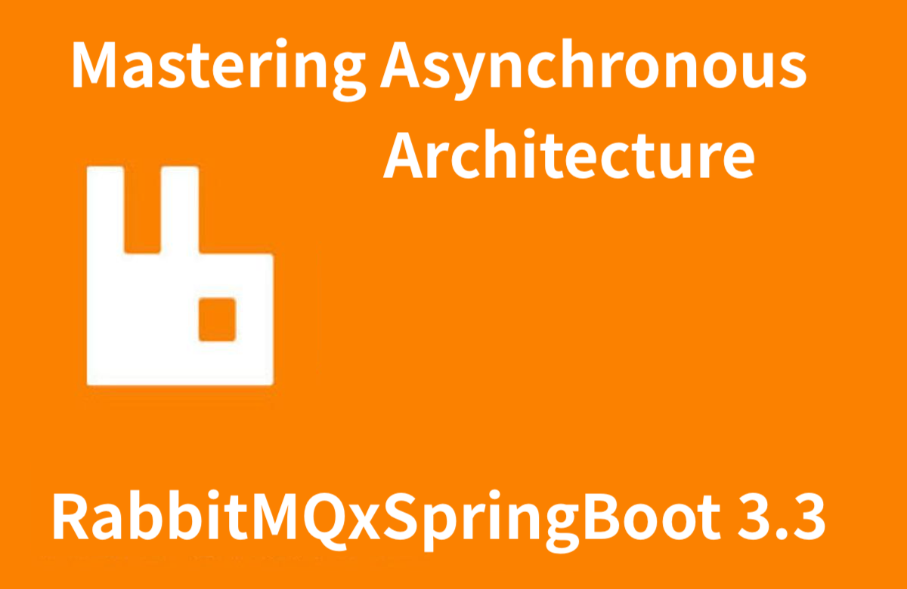

# HelloMessageQueue
### 인프런 RabbitMQ를 이용한 비동기 아키텍처 한방에 해결하기 강의 소스 

 

# 인프런 강의 목록

- [시니어면접관이 알려주는 개발자 취업과 이직, 한방에 해결하기 이론편](https://www.inflearn.com/course/%EC%8B%9C%EB%8B%88%EC%96%B4-%EB%A9%B4%EC%A0%91%EA%B4%80-%EC%95%8C%EB%A0%A4%EC%A3%BC%EB%8A%94-%EC%B7%A8%EC%97%85-%EC%9D%B4%EC%A7%81-%EC%9D%B4%EB%A1%A0)
- [시니어면접관이 알려주는 개발자 취업과 이직, 한방에 해결하기 실전편](https://www.inflearn.com/course/%EC%8B%9C%EB%8B%88%EC%96%B4-%EB%A9%B4%EC%A0%91%EA%B4%80-%EC%95%8C%EB%A0%A4%EC%A3%BC%EB%8A%94-%EC%B7%A8%EC%97%85-%EC%9D%B4%EC%A7%81-%EC%8B%A4%EC%A0%84)

- [RabbitMQ를 이용한 비동기 아키텍처 한방에 해결하기](https://www.inflearn.com/course/rabbitmq-%EB%B9%84%EB%8F%99%EA%B8%B0-%EC%95%84%ED%82%A4%ED%85%8D%EC%B2%98-%ED%95%9C%EB%B0%A9%EC%97%90)
> 
> 기술면접에서 물어보는 비동기 아키텍처와 분산처리의 이해  
> AMQP 특징과 RabbitMQ의 이해  
> SpringBoot 기반의 RabbitMQ 단계별 예제 습득  
> DB 연동과 메시지 큐의 Transaction 처리하기  
> Exchange와 Routing Model의 이해  
> Pub/Sub을 이용한 실시간 알람 시스템 구현하기  
> Routing Model을 활용한 Log 수집하기  
> Dead Letter Queue와 Retry를 이용한 재처리 방안  
>

## 강의 세부 목차 
- RabbitMQ 개요 
- 주요 용어와 Exchange의 이해 
- RabbitMQ의 기본 비동기 메시지 전송
- Consumer간 작업 분배 - WorkQueue
- Pub/Sub 모델을 이용한 실시간 알림과 뉴스 구독 (WebSocket, STOMP)
- Routing Model을 이용한 Log 수집
- DeadLetterQueue 재처리와 Retry 
- DB 연동과 RabbitMQ의 Transaction 처리 
- 기술 면접에서 알아두면 좋을 개념 소개 
- 부록, Slack을 이용한 데드레터 알림 발송 시스템 

Contact : https://linktr.ee/codevillains